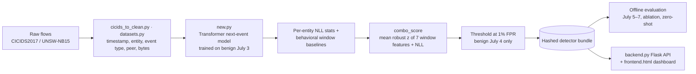

# Portfolio Readiness Implementation Plan

> **For agentic workers:** REQUIRED SUB-SKILL: Use superpowers:executing-plans to implement this plan task-by-task (execution method chosen by the user on 2026-10-08: **Native**, meaning the session implements every task itself, then one fresh reviewer on the most capable model reviews the whole branch at the end). Steps use checkbox (`- [ ]`) syntax for tracking; tick each box as you complete it so a cleared session can resume from the first unticked step.
>
> **Stop points that need the human:** Task 1 Step 5 (merge choice), Task 6 Steps 1–2 (stop if the winner/threshold differs or ablation recall is off by >5 points), Task 8 Step 5 (manual UNSW download; skip Phase C if unavailable), Task 9 Step 3 (optional screenshot). Task 6 Steps 1–2 and Task 8 Step 6 are long GPU jobs in the WSL environment. Run them in the background, or ask the human to run them and report back.

**Goal:** Make every number in the README reproducible from committed code and defensible under interview scrutiny. That means: finish the half-done cleanup, publish candidate-selection provenance, per-family recall, latency, and an NLL ablation; run an honest UNSW-NB15 zero-shot; and add a findings/limitations section and an architecture diagram.

**Architecture:** No new subsystems. All published numbers flow through one pipeline: run scripts write JSON artifacts under the gitignored `outputs/runs/`; `scripts/consolidate_benchmarks.py` reads those artifacts and writes `outputs/benchmark_summary.json` (committed); `scripts/render_results.py` is the only writer of the README results block. This plan widens that pipeline (more fields, two new artifact types) instead of adding a parallel one. One small runtime addition (`DetectorRuntime(ablations=...)`) lets a single scoring pass emit both the shipped score and a score with named features removed.

**Tech Stack:** Python 3.11, pandas, numpy, scikit-learn, TensorFlow/Keras (inference only, never retraining), pytest.

**Spec:** None. The brief was agreed in the 2026-10-08 brainstorming conversation: the goal is a portfolio/resume piece, success means every README/resume number is reproducible from committed artifacts and survives scrutiny, and the repo looks finished. New modeling research and productionizing the API are out of scope. Retrained UNSW-NB15 runs were explicitly dropped as low value.

**Facts established during planning (do not re-derive):**
- The candidate-selection winner `equal_weight_combined` **is** the bundle's `combo_score`. Its development threshold `4.2979942828618505` equals seed 42's frozen test threshold `4.297994232258838`. The README headline is therefore already the frozen winner's July 5–7 result.
- Ordering problem: the 3-seed test results were committed at 2026-09-15 17:44 CDT (`21505759`), and selection ran at 2026-09-15 23:23 UTC (18:23 CDT). Selection came *after* test publication. This must be disclosed in the README.
- Transformer NLL alone (`entity_nll_z`) gets 0.36% / 0.01% / 0.01% test recall at its frozen threshold (seeds 42/43/44), with ROC-AUC ≈ 0.70. On development it gets 0% macro family recall.
- Batch-one inference latency is measured per run (`metrics_summary.json` → `inference_benchmark.batch_one_ms.p95`: 33.7 / 28.2 / 35.2 ms). `screen_candidates` was never given it, so `candidate_selection.json` writes `Infinity`, which is not valid strict JSON.
- `models/detector_bundle` is the **seed 42** bundle (`bundle.json` → `dataset.seed == 42`).
- CICIDS tokens use `event_type_from_proto_dport` classes (`TCP_WELL_KNOWN`, `UDP_EPHEMERAL`, `P0_WELL_KNOWN`, …). `adapt_unsw_nb15` emits `tcp:80`, so a zero-shot run as currently written maps every UNSW event to `UNK`.

## Global Constraints

- `python -m pytest tests -q` must be fully green after every task.
- Do not retrain or modify the training/evaluation path in `new.py`. Published per-seed numbers stay as they are. (Also: `new.py` has mixed CRLF/LF line endings, and tool edits normalize them. Do not touch it.)
- Test labels never set a threshold. Every threshold in this plan is calibrated on benign rows from CICIDS July 4 (development), or frozen in the bundle.
- `outputs/runs/` stays gitignored. Only `outputs/benchmark_summary.json`, `README.md`, code, and tests are committed.
- Every JSON artifact this plan writes uses `json.dumps(..., allow_nan=False)`.
- `write_run_manifest` refuses existing directories (`exist_ok=False`). Every run command uses a fresh `--out` directory.
- Long-running data jobs (Tasks 6 and 8) run in the same WSL + GPU environment that produced the existing runs (TensorFlow 2.21, `python` on PATH, `data/cicids_clean.csv` present).
- Commit with `git add <specific files>`, never `git add -A`. End every commit message with `Co-Authored-By: Claude Opus 5.5 <noreply@anthropic.com>`.

## Review Focus

- **Attack families present in only some runs** (e.g. a family missing from one seed's test set): the per-family aggregate must average over the runs where the family appears and report `n_runs`, not crash or count it as 0. Pinned in Task 5 (`test_family_missing_from_one_run_is_averaged_over_present_runs`).
- **Non-finite numbers in artifacts** (`Infinity` latency from older selection runs): consolidation must still produce strict JSON. Pinned in Task 2 (`test_unmeasured_latency_is_null_and_json_strict`) and Task 5 (`test_selection_with_infinite_latency_consolidates_to_strict_json`).
- **Non-numeric UNSW ports** (`0x000b`, `-`): the CICIDS token scheme must map them to the `_REGISTERED` class, the same as CICIDS's own NaN-port rule, not crash or drop the row. Pinned in Task 7.
- **Test labels leaking into ablation thresholds**: relabeling every test row as benign must not change any ablation threshold. Pinned in Task 4 (`test_ablation_thresholds_ignore_test_labels`).
- **Ablation naming a feature the bundle doesn't have**: must fail at runtime construction with a clear error, not silently score with all features. Pinned in Task 3.

---

## Phase A: Housekeeping

### Task 1: Finish and merge the codebase cleanup

**Files:**
- Modify: `LICENSE:1` (on `main`)
- Execute: Tasks 6–11 of `docs/superpowers/plans/2026-09-16-codebase-cleanup.md`, in worktree `.claude/worktrees/codebase-cleanup` (branch `worktree-codebase-cleanup`)

**Interfaces:**
- Consumes: the existing cleanup plan. Its Tasks 1–5 are already committed on the branch (`d53b24c9`, `1794895e`, `b91502e4`, `24e40066`), and Task 4 was a recorded no-op.
- Produces: `main` contains the cleanup. `backend.py` is bundle-only. Later tasks of this plan branch from that `main`.

- [x] **Step 1: Revert the accidental LICENSE edit on main**

Run: `git diff LICENSE`
Expected: a single change, `-MIT License` → `+claMIT License`.

Run: `git checkout -- LICENSE && git status --short LICENSE`
Expected: no output (file clean).

- [x] **Step 2: Execute cleanup Tasks 6–11 in the worktree**

Work in `.claude/worktrees/codebase-cleanup`. Follow `docs/superpowers/plans/2026-09-16-codebase-cleanup.md` Task 6 ("Simplify `backend.py`'s `load_model_and_config` to bundle-only") through Task 11 ("Final verification pass") exactly as written, including each task's grep-before-delete and per-task commit. That plan's Global Constraints apply.

- [x] **Step 3: Verify the branch**

Run (in the worktree): `python -m pytest tests -q`
Expected: all pass. Paste the summary line.

- [x] **Step 4: Resolve the untracked plan file on main before merging**

Run: `git -C .claude/worktrees/codebase-cleanup ls-files docs/superpowers/plans/2026-09-16-codebase-cleanup.md`
- If it prints the path, the branch tracks the file. Run `git diff --no-index docs/superpowers/plans/2026-09-16-codebase-cleanup.md .claude/worktrees/codebase-cleanup/docs/superpowers/plans/2026-09-16-codebase-cleanup.md`. If there is no diff, delete the untracked copy on `main` (`rm docs/superpowers/plans/2026-09-16-codebase-cleanup.md`) so the merge doesn't refuse to overwrite it. If there is a diff, keep the branch version and report the difference.
- If it prints nothing, commit the plan on `main`: `git add docs/superpowers/plans/2026-09-16-codebase-cleanup.md && git commit -m "docs: add codebase cleanup plan"`.

- [x] **Step 5: Merge**

Use superpowers:finishing-a-development-branch to merge `worktree-codebase-cleanup` into `main` and remove the worktree. After the merge, run on `main`: `python -m pytest tests -q`. Expected: all pass.

- [x] **Step 6: Commit this plan**

```bash
git add docs/superpowers/plans/2026-10-08-portfolio-readiness.md
git commit -m "docs: add portfolio readiness plan

Co-Authored-By: Claude Opus 5.5 <noreply@anthropic.com>"
```

---

## Phase B: Close the CICIDS benchmark story

Before Task 2, create a fresh branch from the post-merge `main` (superpowers:using-git-worktrees).

### Task 2: Report unmeasured candidate latency as `null`, not `Infinity`

**Files:**
- Modify: `benchmark.py` (`screen_candidates`, `improvement_gate`)
- Test: `tests/test_benchmark_selection.py`

**Interfaces:**
- Consumes: nothing new.
- Produces: `screen_candidates(...)["candidates"][i]["p95_latency_ms"]` and `["winner"]["p95_latency_ms"]` are `float | None`. `None` means not measured, and it sorts last on the latency tie-break.

- [ ] **Step 1: Write the failing tests**

Append to `tests/test_benchmark_selection.py` (add `import json` at the top):

```python
def test_unmeasured_latency_is_null_and_json_strict():
    frame = pd.DataFrame({"Label": ["BENIGN"] * 100 + ["A"] * 10,
                          "s": list(range(100)) + [200] * 10})
    out = screen_candidates(frame, ["s"], target_fpr=.01)
    assert out["winner"]["p95_latency_ms"] is None
    json.dumps(out, allow_nan=False)


def test_measured_latency_beats_unmeasured_on_tie():
    frame = pd.DataFrame({"Label": ["BENIGN"] * 100 + ["A"] * 10,
                          "a": list(range(100)) + [200] * 10,
                          "b": list(range(100)) + [200] * 10})
    out = screen_candidates(frame, ["a", "b"], target_fpr=.01, latency_p95_ms={"b": 5.0})
    assert out["winner"]["variant"] == "b"
    assert out["winner"]["p95_latency_ms"] == 5.0


def test_improvement_gate_treats_unmeasured_latency_as_unbounded():
    current = {"macro_attack_family_recall": .5, "fpr": .01, "p95_latency_ms": None}
    assert improvement_gate(current, {"macro_attack_family_recall": .6, "fpr": .01,
                                      "p95_latency_ms": None})
```

- [ ] **Step 2: Run to verify failure**

Run: `python -m pytest tests/test_benchmark_selection.py -q`
Expected: `test_unmeasured_latency_is_null_and_json_strict` FAILS (`inf` is not `None`), and `test_improvement_gate_treats_unmeasured_latency_as_unbounded` FAILS with `TypeError` (`None * 1.10`).

- [ ] **Step 3: Implement**

In `benchmark.py`, add above `screen_candidates`:

```python
def _latency_sort_key(value: float | None) -> float:
    """Unmeasured latency (None) sorts after every measured value."""
    return np.inf if value is None else float(value)
```

In `screen_candidates`, replace the row's latency entry and the winner sort key:

```python
                     "p95_latency_ms": (float(latency_p95_ms[name])
                                        if name in latency_p95_ms else None)})
```

```python
    winner = sorted(eligible, key=lambda r: (-r["macro_attack_family_recall"], -r["precision"],
                                              _latency_sort_key(r["p95_latency_ms"]), r["variant"]))[0]
```

Replace `improvement_gate`'s latency clause:

```python
def improvement_gate(current: dict, candidate: dict) -> bool:
    return bool(candidate["macro_attack_family_recall"] - current["macro_attack_family_recall"] >= .02
                and candidate["fpr"] - current["fpr"] <= .01
                and _latency_sort_key(candidate["p95_latency_ms"])
                <= _latency_sort_key(current["p95_latency_ms"]) * 1.10)
```

(`inf <= inf * 1.10` is `True`, so an unmeasured-vs-unmeasured comparison passes the latency clause.)

- [ ] **Step 4: Make `select_candidate.py` write strict JSON**

In `scripts/select_candidate.py` `main()`, change the final write to:

```python
    (out / "candidate_selection.json").write_text(json.dumps(result, indent=2, allow_nan=False),
                                                  encoding="utf-8")
```

- [ ] **Step 5: Run the tests**

Run: `python -m pytest tests -q`
Expected: all pass, including the existing `test_candidate_selection_uses_macro_recall_then_precision_then_latency`.

- [ ] **Step 6: Commit**

```bash
git add benchmark.py scripts/select_candidate.py tests/test_benchmark_selection.py
git commit -m "Report unmeasured candidate latency as null instead of Infinity

Co-Authored-By: Claude Opus 5.5 <noreply@anthropic.com>"
```

### Task 3: `DetectorRuntime` feature ablations

**Files:**
- Create: `tests/fakes.py`
- Modify: `detector_bundle.py` (`DetectorRuntime.__init__`, `_score_features`, `score_event`)
- Test: `tests/test_runtime_ablation.py` (new)

**Interfaces:**
- Consumes: nothing new.
- Produces:
  - `DetectorRuntime(bundle, model, *, ablations: dict[str, tuple[str, ...]] | None = None)`. Each ablation `name` adds the key `f"score_{name}"` to every non-`None` `score_event` result. Its value is the mean absolute robust z over the bundle's `window_baselines.features` minus the named features. `score`, `is_anomaly`, and every other existing key are unchanged. Raises `ValueError` if an ablation names an unknown feature or drops every feature.
  - `tests/fakes.py`: `COMBO_FEATURES: list[str]`; `FakeModel` (callable `(x, training=False) -> np.ndarray` of shape `(len(x), 3)`); `fake_bundle(vocabulary=(...), seq_len=2) -> dict`; `entity_events(entity, day, n, *, label="BENIGN", varied_peers=False, bytes_base=100.0) -> pd.DataFrame` with columns `timestamp, entity_id, dst_id, event_type, bytes, Label`.

- [ ] **Step 1: Create the shared test fakes**

Create `tests/fakes.py`:

```python
"""Shared lightweight stand-ins for the Keras model and a detector bundle."""

import numpy as np
import pandas as pd

COMBO_FEATURES = ["tok_uniq", "tok_top_share", "dst_uniq", "dst_top_share",
                  "bytes_mean", "bytes_std", "repeat_last", "nll"]


class FakeModel:
    """Fixed next-token distribution over 3 ids (PAD, UNK, one known token)."""

    def __call__(self, x, training=False):
        return np.tile(np.array([0.2, 0.3, 0.5]), (np.asarray(x).shape[0], 1))


def fake_bundle(vocabulary=("TCP_WELL_KNOWN|DST=OTHER|BYTES_Q0",), seq_len=2):
    med = {k: 0.0 for k in COMBO_FEATURES}
    scale = {k: 1.0 for k in COMBO_FEATURES}
    return {"vocabulary": list(vocabulary), "destinations": [], "bytes_edges_log1p": [0, 10],
            "seq_len": seq_len, "entity_nll_stats": [], "global_nll": {"mean": 1.0, "std": 2.0},
            "window_baselines": {"features": list(COMBO_FEATURES), "global_median": med,
                                 "global_scale": scale, "entity_median": {}, "entity_scale": {}},
            "score_definition": {"variant": "combo_score"}, "threshold": 1.0,
            "allowlist": [], "model_version": "test", "dataset": {"seed": 42},
            "hashes": {"payload_sha256": "test"}}


def entity_events(entity, day, n, *, label="BENIGN", varied_peers=False, bytes_base=100.0):
    start = pd.Timestamp(day, tz="UTC") + pd.Timedelta(hours=9)
    return pd.DataFrame({
        "timestamp": [start + pd.Timedelta(seconds=i) for i in range(n)],
        "entity_id": entity,
        "dst_id": [f"peer_{i}" if varied_peers else "peer" for i in range(n)],
        "event_type": "TCP_WELL_KNOWN",
        "bytes": [bytes_base + i for i in range(n)],
        "Label": label,
    })
```

- [ ] **Step 2: Write the failing tests**

Create `tests/test_runtime_ablation.py`:

```python
import pytest

from detector_bundle import DetectorRuntime
from tests.fakes import FakeModel, entity_events, fake_bundle


def _last_result(runtime):
    results = [runtime.score_event(e) for e in
               entity_events("h", "2017-07-04", 3).to_dict("records")]
    assert results[-1] is not None
    return results[-1]


def test_ablation_score_drops_named_feature_from_mean():
    result = _last_result(DetectorRuntime(fake_bundle(), FakeModel(),
                                          ablations={"without_nll": ("nll",)}))
    # fake_bundle has median 0 / scale 1, so each contribution is |feature|.
    assert result["score_without_nll"] * 7 == pytest.approx(result["score"] * 8 - abs(result["nll"]))


def test_ablation_leaves_shipped_score_unchanged():
    plain = _last_result(DetectorRuntime(fake_bundle(), FakeModel()))
    ablated = _last_result(DetectorRuntime(fake_bundle(), FakeModel(),
                                           ablations={"without_nll": ("nll",)}))
    assert ablated["score"] == plain["score"]
    assert ablated["is_anomaly"] == plain["is_anomaly"]


def test_no_ablations_adds_no_extra_score_keys():
    result = _last_result(DetectorRuntime(fake_bundle(), FakeModel()))
    assert [k for k in result if k.startswith("score_")] == []


def test_unknown_ablation_feature_is_rejected():
    with pytest.raises(ValueError, match="unknown features"):
        DetectorRuntime(fake_bundle(), FakeModel(), ablations={"x": ("bogus",)})


def test_ablation_dropping_every_feature_is_rejected():
    bundle = fake_bundle()
    with pytest.raises(ValueError, match="every feature"):
        DetectorRuntime(bundle, FakeModel(),
                        ablations={"x": tuple(bundle["window_baselines"]["features"])})
```

- [ ] **Step 3: Run to verify failure**

Run: `python -m pytest tests/test_runtime_ablation.py -q`
Expected: FAIL with `TypeError: DetectorRuntime.__init__() got an unexpected keyword argument 'ablations'` (and `test_no_ablations_adds_no_extra_score_keys` passes).

- [ ] **Step 4: Implement**

In `detector_bundle.py`, change `DetectorRuntime.__init__`'s signature and append the ablation setup at the end of the method body:

```python
    def __init__(self, bundle: dict, model: Any, *,
                 ablations: dict[str, tuple[str, ...]] | None = None):
```

```python
        features = list(bundle["window_baselines"]["features"])
        self.ablations: dict[str, list[str]] = {}
        for name, dropped in (ablations or {}).items():
            unknown = set(dropped) - set(features)
            if unknown:
                raise ValueError(f"ablation {name!r} drops unknown features {sorted(unknown)}")
            kept = [f for f in features if f not in set(dropped)]
            if not kept:
                raise ValueError(f"ablation {name!r} drops every feature")
            self.ablations[name] = kept
```

Replace `_score_features` so it can score a feature subset:

```python
    def _score_features(self, entity: str, features: dict[str, float],
                        names: list[str] | None = None) -> tuple[float, str]:
        baseline = self.bundle["window_baselines"]
        med = baseline["entity_median"].get(entity, baseline["global_median"])
        scale = baseline["entity_scale"].get(entity, baseline["global_scale"])
        contributions = {name: abs(np.clip((features[name] - med[name]) / max(scale[name], 1e-6), -50, 50))
                         for name in (names if names is not None else baseline["features"])}
        return float(np.mean(list(contributions.values()))), max(contributions, key=contributions.get)
```

In `score_event`, directly after the `result = {...}` dict literal (still inside `if len(context) == seq_len:`), add:

```python
            for name, kept in self.ablations.items():
                result[f"score_{name}"] = self._score_features(entity, features, kept)[0]
```

- [ ] **Step 5: Run the tests**

Run: `python -m pytest tests -q`
Expected: all pass (including `tests/test_detector_bundle.py` parity tests).

- [ ] **Step 6: Commit**

```bash
git add detector_bundle.py tests/fakes.py tests/test_runtime_ablation.py
git commit -m "Add feature ablations to DetectorRuntime scoring

Co-Authored-By: Claude Opus 5.5 <noreply@anthropic.com>"
```

### Task 4: NLL ablation script

**Files:**
- Create: `scripts/ablate_nll.py`
- Test: `tests/test_ablate_nll.py` (new)

**Interfaces:**
- Consumes: `DetectorRuntime(..., ablations=...)` from Task 3 (adds result key `score_without_nll`); `tests/fakes.py` from Task 3; `score_events_batched`, `calibrate_threshold(benign_scores, target_fpr) -> float`, `frozen_operating_point`, `per_attack_metrics`, `is_benign`, `write_run_manifest`, `cicids_day_split`, `load_and_adapt_events`.
- Produces: `run_ablation(development, test, bundle, model, *, target_fpr) -> dict` with shape
  `{"target_fpr": float, "bundle_seed": int | None, "development_rows": int, "test_rows": int, "variants": {"combo_score" | "combo_without_nll" | "transformer_nll_z": {"score_column": str, "frozen_operating_point": dict, "macro_attack_family_recall": float, "per_attack": dict}}}`.
  The CLI writes it to `<out>/ablation.json` alongside `<out>/manifest.json`. Task 5 reads exactly these keys.

- [ ] **Step 1: Write the failing tests**

Create `tests/test_ablate_nll.py`:

```python
import json

import pandas as pd

from scripts.ablate_nll import run_ablation
from tests.fakes import FakeModel, entity_events, fake_bundle


def _day(day):
    benign = [entity_events(f"h{k}", day, 20) for k in range(6)]
    attack = entity_events("attacker", day, 8, label="PortScan", varied_peers=True, bytes_base=50000.0)
    return pd.concat(benign + [attack], ignore_index=True)


def test_run_ablation_reports_three_variants_on_test_rows_only():
    result = run_ablation(_day("2017-07-04"), _day("2017-07-05"), fake_bundle(), FakeModel(),
                          target_fpr=0.5)
    assert set(result["variants"]) == {"combo_score", "combo_without_nll", "transformer_nll_z"}
    assert result["development_rows"] > 0 and result["test_rows"] > 0
    assert result["bundle_seed"] == 42
    for variant in result["variants"].values():
        point = variant["frozen_operating_point"]
        assert 0.0 <= point["observed_test_fpr"] <= 1.0
        assert point["calibration_population"]["labels_used_for_threshold"] is False
    json.dumps(result, allow_nan=False)


def test_ablation_thresholds_ignore_test_labels():
    dev, test = _day("2017-07-04"), _day("2017-07-05")
    a = run_ablation(dev, test, fake_bundle(), FakeModel(), target_fpr=0.5)
    b = run_ablation(dev, test.assign(Label="BENIGN"), fake_bundle(), FakeModel(), target_fpr=0.5)
    for name in a["variants"]:
        assert (a["variants"][name]["frozen_operating_point"]["threshold"]
                == b["variants"][name]["frozen_operating_point"]["threshold"])
```

- [ ] **Step 2: Run to verify failure**

Run: `python -m pytest tests/test_ablate_nll.py -q`
Expected: FAIL with `ModuleNotFoundError: No module named 'scripts.ablate_nll'`.

- [ ] **Step 3: Implement**

Create `scripts/ablate_nll.py`:

```python
"""What does the Transformer contribute? NLL-feature ablation of the frozen detector.

Scores CICIDS2017 development (July 4) and frozen test (July 5-7) as one causal
stream with the shipped bundle, in a single pass that emits three scores per
event: the shipped combo_score, combo_score with the Transformer NLL feature
removed, and the Transformer's entity NLL z-score alone. Each variant's
threshold is calibrated on development benign rows only, then applied
unchanged to the test days.
"""

import argparse
import json
import sys
from pathlib import Path

import numpy as np
import pandas as pd

sys.path.insert(0, str(Path(__file__).resolve().parents[1]))
from benchmark import write_run_manifest
from benchmark_metrics import frozen_operating_point, is_benign, per_attack_metrics
from datasets import cicids_day_split
from detector_bundle import DetectorRuntime, load_detector_bundle, score_events_batched
from new import calibrate_threshold, load_and_adapt_events

VARIANTS = {"combo_score": "score",
            "combo_without_nll": "score_without_nll",
            "transformer_nll_z": "nll_z"}


def run_ablation(development: pd.DataFrame, test: pd.DataFrame, bundle: dict, model, *,
                 target_fpr: float) -> dict:
    stream = pd.concat([development, test], ignore_index=True)
    stream["event_row_id"] = np.arange(len(stream))
    runtime = DetectorRuntime(bundle, model, ablations={"without_nll": ("nll",)})
    scored = score_events_batched(stream, runtime)
    on_test = scored["event_row_id"].to_numpy() >= len(development)
    dev, tst = scored.loc[~on_test], scored.loc[on_test]
    dev_benign = is_benign(dev["Label"])

    result = {"target_fpr": float(target_fpr),
              "bundle_seed": bundle.get("dataset", {}).get("seed"),
              "development_rows": int(len(dev)), "test_rows": int(len(tst)), "variants": {}}
    for variant, column in VARIANTS.items():
        threshold = calibrate_threshold(dev[column].to_numpy(float)[dev_benign], target_fpr)
        calibration = {"split": "development", "benign_rows": int(dev_benign.sum()),
                       "target_fpr": float(target_fpr), "labels_used_for_threshold": False}
        families = per_attack_metrics(tst["Label"], tst[column], threshold)
        result["variants"][variant] = {
            "score_column": column,
            "frozen_operating_point": frozen_operating_point(tst["Label"], tst[column],
                                                             threshold, calibration),
            "macro_attack_family_recall": (float(np.mean([f["recall"] for f in families.values()]))
                                           if families else 0.0),
            "per_attack": families,
        }
    return result


def main():
    parser = argparse.ArgumentParser()
    parser.add_argument("--csv", required=True, help="clean-format CICIDS csv (data/cicids_clean.csv)")
    parser.add_argument("--bundle", default="models/detector_bundle")
    parser.add_argument("--target_fpr", type=float, default=0.01)
    parser.add_argument("--out", required=True)
    args = parser.parse_args()

    events = load_and_adapt_events(args.csv, fmt="clean")
    _train, development, test = cicids_day_split(events)
    bundle, model = load_detector_bundle(args.bundle)
    result = run_ablation(development, test, bundle, model, target_fpr=args.target_fpr)
    result["bundle_hashes"] = bundle["hashes"]

    out = Path(args.out)
    write_run_manifest(out, dataset_name="CICIDS2017 NLL ablation (frozen bundle)",
                       source_files=[args.csv],
                       splits={"development": development, "frozen_test": test},
                       config={"target_fpr": args.target_fpr, "bundle": args.bundle},
                       seed=int(result["bundle_seed"] or 0))
    (out / "ablation.json").write_text(json.dumps(result, indent=2, allow_nan=False), encoding="utf-8")


if __name__ == "__main__":
    main()
```

- [ ] **Step 4: Run the tests**

Run: `python -m pytest tests -q`
Expected: all pass.

- [ ] **Step 5: Commit**

```bash
git add scripts/ablate_nll.py tests/test_ablate_nll.py
git commit -m "Add NLL ablation script for the frozen CICIDS detector

Co-Authored-By: Claude Opus 5.5 <noreply@anthropic.com>"
```

### Task 5: Consolidate and render provenance, per-family recall, latency, and ablation

**Files:**
- Modify: `scripts/consolidate_benchmarks.py` (full rewrite below)
- Modify: `scripts/render_results.py` (`render` and helpers; `update_readme`/`main` unchanged)
- Test: `tests/test_consolidate_benchmarks.py` (new), `tests/test_render_results.py`

**Interfaces:**
- Consumes: per-run `metrics_summary.json` (keys `detection.frozen_operating_point`, `detection_by_label`, `inference_benchmark.batch_one_ms.p95`, `run_manifest.seed`); zero-shot `metrics.json` (keys `frozen_operating_point`, `per_attack`); `candidate_selection.json` (Task 2 shape); `ablation.json` (Task 4 shape).
- Produces: `build_summary(runs: list[tuple[str, str]], selection_path: str | None = None, ablation_path: str | None = None) -> dict`, written as `outputs/benchmark_summary.json`:
  ```
  {"schema_version": "1.1",
   "datasets": {NAME: {"seeds": [...], "aggregate": {recall|precision|f1|observed_test_fpr|benign_alerts_per_10000_events|macro_attack_family_recall?|batch_one_p95_ms?: {"mean","std"}},
                       "per_family": {FAMILY: {"mean","std","n_runs","sample_count"}}, "runs": [...]}},
   "selection"?: {"artifact","winner","winner_threshold","candidates": [{"variant","macro_attack_family_recall","precision","fpr"}]},
   "ablation"?: {"artifact","bundle_seed","variants": {NAME: {"recall","precision","f1","observed_test_fpr","macro_attack_family_recall"}}}}
  ```
  `render(summary) -> str` emits the headline table (now with "Macro family recall" and "Batch-1 p95 latency (ms)" columns), one per-family table per dataset that has `per_family`, then the selection table and the ablation table when present.

- [ ] **Step 1: Write the failing consolidation tests**

Create `tests/test_consolidate_benchmarks.py`:

```python
import json

import pytest

from scripts.consolidate_benchmarks import build_summary

POINT = {"recall": .9, "precision": .8, "f1": .85, "observed_test_fpr": .03,
         "benign_alerts_per_10000_events": 300.0}


def _run(tmp_path, seed, families, p95=30.0):
    raw = {"run_manifest": {"seed": seed}, "detection": {"frozen_operating_point": POINT},
           "detection_by_label": {f: {"sample_count": n, "recall": r} for f, (n, r) in families.items()},
           "inference_benchmark": {"batch_one_ms": {"p95": p95}}}
    path = tmp_path / f"seed-{seed}.json"
    path.write_text(json.dumps(raw), encoding="utf-8")
    return str(path)


def _three_seeds(tmp_path):
    fam = {"Bot": (10, .0), "DDoS": (100, 1.0)}
    return [("CICIDS", _run(tmp_path, s, fam, p95)) for s, p95 in ((42, 30.0), (43, 32.0), (44, 34.0))]


def test_macro_recall_per_family_and_latency_are_aggregated(tmp_path):
    summary = build_summary(_three_seeds(tmp_path))
    data = summary["datasets"]["CICIDS"]
    assert data["aggregate"]["macro_attack_family_recall"]["mean"] == pytest.approx(.5)
    assert data["aggregate"]["batch_one_p95_ms"]["mean"] == pytest.approx(32.0)
    assert data["per_family"]["Bot"] == {"mean": 0.0, "std": 0.0, "n_runs": 3, "sample_count": 10}
    json.dumps(summary, allow_nan=False)


def test_family_missing_from_one_run_is_averaged_over_present_runs(tmp_path):
    runs = [("CICIDS", _run(tmp_path, 42, {"Bot": (10, .2), "DDoS": (100, 1.0)})),
            ("CICIDS", _run(tmp_path, 43, {"Bot": (10, .4), "DDoS": (100, 1.0)})),
            ("CICIDS", _run(tmp_path, 44, {"DDoS": (100, 1.0)}))]
    bot = build_summary(runs)["datasets"]["CICIDS"]["per_family"]["Bot"]
    assert bot["n_runs"] == 2
    assert bot["mean"] == pytest.approx(.3)


def test_reference_runs_must_cover_all_three_seeds(tmp_path):
    with pytest.raises(ValueError, match="exactly seeds"):
        build_summary(_three_seeds(tmp_path)[:2])


def test_zero_shot_artifact_shape_is_accepted(tmp_path):
    path = tmp_path / "metrics.json"
    path.write_text(json.dumps({"frozen_operating_point": POINT,
                                "per_attack": {"Exploits": {"sample_count": 5, "recall": .4}}}),
                    encoding="utf-8")
    data = build_summary([("UNSW zero-shot", str(path))])["datasets"]["UNSW zero-shot"]
    assert data["seeds"] == ["frozen"]
    assert "batch_one_p95_ms" not in data["aggregate"]
    assert data["aggregate"]["macro_attack_family_recall"]["mean"] == pytest.approx(.4)


def test_selection_with_infinite_latency_consolidates_to_strict_json(tmp_path):
    row = {"variant": "equal_weight_combined", "threshold": 4.3, "macro_attack_family_recall": .85,
           "precision": .76, "fpr": .01, "p95_latency_ms": float("inf")}
    selection = tmp_path / "candidate_selection.json"
    selection.write_text(json.dumps({"candidates": [row], "winner": row}), encoding="utf-8")
    summary = build_summary(_three_seeds(tmp_path), selection_path=str(selection))
    assert summary["selection"]["winner"] == "equal_weight_combined"
    assert summary["selection"]["winner_threshold"] == 4.3
    json.dumps(summary, allow_nan=False)


def test_ablation_is_flattened(tmp_path):
    variant = {"score_column": "score", "frozen_operating_point": POINT,
               "macro_attack_family_recall": .6, "per_attack": {}}
    ablation = tmp_path / "ablation.json"
    ablation.write_text(json.dumps({"bundle_seed": 42, "variants": {"combo_score": variant}}),
                        encoding="utf-8")
    summary = build_summary(_three_seeds(tmp_path), ablation_path=str(ablation))
    assert summary["ablation"]["bundle_seed"] == 42
    assert summary["ablation"]["variants"]["combo_score"] == {
        "recall": .9, "precision": .8, "f1": .85, "observed_test_fpr": .03,
        "macro_attack_family_recall": .6}
```

- [ ] **Step 2: Write the failing render test**

Append to `tests/test_render_results.py`:

```python
def test_render_includes_families_selection_and_ablation():
    metric = {"mean": .8, "std": .01}
    summary = {
        "datasets": {"D": {"seeds": [42], "aggregate": {
            "recall": metric, "precision": metric, "f1": metric,
            "observed_test_fpr": metric, "benign_alerts_per_10000_events": {"mean": 100, "std": 0},
            "macro_attack_family_recall": {"mean": .5, "std": 0},
            "batch_one_p95_ms": {"mean": 33.7, "std": 1.0}},
            "per_family": {"Bot": {"mean": .005, "std": 0, "n_runs": 1, "sample_count": 1952},
                           "DDoS": {"mean": .9, "std": 0, "n_runs": 1, "sample_count": 128025}}}},
        "selection": {"winner": "equal_weight_combined", "winner_threshold": 4.3, "candidates": [
            {"variant": "transformer_nll", "macro_attack_family_recall": 0.0, "precision": 0.0, "fpr": .01},
            {"variant": "equal_weight_combined", "macro_attack_family_recall": .8486,
             "precision": .7627, "fpr": .01}]},
        "ablation": {"bundle_seed": 42, "variants": {"combo_score": {
            "recall": .97, "precision": .92, "f1": .94, "observed_test_fpr": .038,
            "macro_attack_family_recall": .6}}},
    }
    text = render(summary)
    assert "50.00 ± 0.00%" in text
    assert "33.70 ± 1.00" in text
    assert "| Bot | 1,952 | 0.50 ± 0.00% |" in text
    assert text.index("| DDoS |") < text.index("| Bot |")
    assert "| equal_weight_combined (selected) | 84.86% | 76.27% | 1.00% |" in text
    assert "seed 42 bundle" in text
    assert "| combo_score | 97.00% | 60.00% | 92.00% | 3.80% |" in text
```

- [ ] **Step 3: Run to verify failure**

Run: `python -m pytest tests/test_consolidate_benchmarks.py tests/test_render_results.py -q`
Expected: consolidation tests FAIL with `ImportError: cannot import name 'build_summary'`, and the new render test FAILS on the missing `50.00 ± 0.00%`.

- [ ] **Step 4: Rewrite `scripts/consolidate_benchmarks.py`**

```python
"""Build the sole README data source from reviewed run metric artifacts."""

import argparse
import json
import sys
from collections import defaultdict
from pathlib import Path

import numpy as np

sys.path.insert(0, str(Path(__file__).resolve().parents[1]))

KEYS = ("recall", "precision", "f1", "observed_test_fpr", "benign_alerts_per_10000_events")
REFERENCE_SEEDS = {42, 43, 44}


def _mean_std(values) -> dict:
    array = np.asarray(values, float)
    return {"mean": float(array.mean()), "std": float(array.std(ddof=0))}


def _read(path: str) -> dict:
    return json.loads(Path(path).read_text(encoding="utf-8"))


def load_run(filename: str) -> dict:
    raw = _read(filename)
    point = raw.get("frozen_operating_point") or raw.get("detection", {}).get("frozen_operating_point")
    if not point:
        raise ValueError(f"{filename} has no frozen_operating_point")
    by_label = raw.get("detection_by_label") or raw.get("per_attack") or {}
    recalls = [float(v["recall"]) for v in by_label.values()]
    p95 = raw.get("inference_benchmark", {}).get("batch_one_ms", {}).get("p95")
    return {"seed": raw.get("run_manifest", {}).get("seed", raw.get("seed", "frozen")),
            "frozen_operating_point": point,
            "macro_attack_family_recall": float(np.mean(recalls)) if recalls else None,
            "per_family": {family: {"sample_count": int(v["sample_count"]), "recall": float(v["recall"])}
                           for family, v in by_label.items()},
            "batch_one_p95_ms": None if p95 is None else float(p95),
            "artifact": str(filename)}


def aggregate_runs(name: str, runs: list[dict]) -> dict:
    numeric_seeds = {run["seed"] for run in runs if isinstance(run["seed"], int)}
    if numeric_seeds and numeric_seeds != REFERENCE_SEEDS:
        raise ValueError(f"{name} must contain exactly seeds 42, 43, and 44; got {sorted(numeric_seeds)}")
    aggregate = {key: _mean_std([run["frozen_operating_point"][key] for run in runs]) for key in KEYS}
    for key in ("macro_attack_family_recall", "batch_one_p95_ms"):
        values = [run[key] for run in runs if run[key] is not None]
        if values:
            aggregate[key] = _mean_std(values)
    families: dict[str, dict] = {}
    for run in runs:
        for family, stats in run["per_family"].items():
            entry = families.setdefault(family, {"sample_count": stats["sample_count"], "recalls": []})
            entry["recalls"].append(stats["recall"])
    per_family = {family: {**_mean_std(entry["recalls"]), "n_runs": len(entry["recalls"]),
                           "sample_count": entry["sample_count"]}
                  for family, entry in families.items()}
    return {"seeds": [run["seed"] for run in runs], "aggregate": aggregate,
            "per_family": per_family, "runs": runs}


def summarize_selection(path: str) -> dict:
    raw = _read(path)
    return {"artifact": str(path), "winner": raw["winner"]["variant"],
            "winner_threshold": float(raw["winner"]["threshold"]),
            "candidates": [{"variant": c["variant"],
                            "macro_attack_family_recall": float(c["macro_attack_family_recall"]),
                            "precision": float(c["precision"]), "fpr": float(c["fpr"])}
                           for c in raw["candidates"]]}


def summarize_ablation(path: str) -> dict:
    raw = _read(path)
    variants = {}
    for name, variant in raw["variants"].items():
        point = variant["frozen_operating_point"]
        variants[name] = {**{key: float(point[key]) for key in ("recall", "precision", "f1",
                                                                "observed_test_fpr")},
                          "macro_attack_family_recall": float(variant["macro_attack_family_recall"])}
    return {"artifact": str(path), "bundle_seed": raw.get("bundle_seed"), "variants": variants}


def build_summary(runs: list[tuple[str, str]], selection_path: str | None = None,
                  ablation_path: str | None = None) -> dict:
    grouped = defaultdict(list)
    for name, filename in runs:
        grouped[name].append(load_run(filename))
    summary = {"schema_version": "1.1",
               "datasets": {name: aggregate_runs(name, group) for name, group in grouped.items()}}
    if selection_path:
        summary["selection"] = summarize_selection(selection_path)
    if ablation_path:
        summary["ablation"] = summarize_ablation(ablation_path)
    return summary


def main():
    parser = argparse.ArgumentParser()
    parser.add_argument("--run", action="append", required=True,
                        help="NAME=metrics.json (repeat for each seed/experiment)")
    parser.add_argument("--selection", help="candidate_selection.json from scripts/select_candidate.py")
    parser.add_argument("--ablation", help="ablation.json from scripts/ablate_nll.py")
    parser.add_argument("--out", default="outputs/benchmark_summary.json")
    args = parser.parse_args()
    runs = []
    for spec in args.run:
        name, separator, filename = spec.partition("=")
        if not separator:
            parser.error("--run must be NAME=metrics.json")
        runs.append((name, filename))
    summary = build_summary(runs, args.selection, args.ablation)
    target = Path(args.out)
    target.parent.mkdir(parents=True, exist_ok=True)
    target.write_text(json.dumps(summary, indent=2, allow_nan=False), encoding="utf-8")


if __name__ == "__main__":
    main()
```

- [ ] **Step 5: Extend `scripts/render_results.py`**

Replace `render` with the following, and add the helpers above it. `_mean_std`, `update_readme`, and `main` stay as they are.

```python
def _pct(value) -> str:
    return "n/a" if value is None else f"{value * 100:.2f}%"


def _family_lines(name: str, result: dict) -> list[str]:
    families = result.get("per_family", {})
    if not families:
        return []
    lines = ["", f"**Per-attack-family recall: {name}** (frozen threshold; mean ± std over runs)", "",
             "| Attack family | Test samples | Recall |", "|---|---:|---:|"]
    for family, stats in sorted(families.items(), key=lambda item: -item[1]["sample_count"]):
        lines.append(f"| {family} | {stats['sample_count']:,} | {_mean_std(stats, True)} |")
    return lines


def _selection_lines(selection: dict) -> list[str]:
    lines = ["", "**Candidate selection** (CICIDS2017 July 4 development labels only; "
                 "each threshold at 1% development FPR)", "",
             "| Candidate | Macro family recall | Precision | Dev FPR |", "|---|---:|---:|---:|"]
    for row in selection["candidates"]:
        mark = " (selected)" if row["variant"] == selection["winner"] else ""
        lines.append(f"| {row['variant']}{mark} | {_pct(row['macro_attack_family_recall'])} | "
                     f"{_pct(row['precision'])} | {_pct(row['fpr'])} |")
    return lines


def _ablation_lines(ablation: dict) -> list[str]:
    lines = ["", f"**Ablation** (seed {ablation['bundle_seed']} bundle; each score's threshold "
                 "calibrated on July 4 benign traffic, applied unchanged to July 5–7)", "",
             "| Score | Recall | Macro family recall | Precision | Test FPR |", "|---|---:|---:|---:|---:|"]
    for name, row in ablation["variants"].items():
        lines.append(f"| {name} | {_pct(row['recall'])} | {_pct(row['macro_attack_family_recall'])} | "
                     f"{_pct(row['precision'])} | {_pct(row['observed_test_fpr'])} |")
    return lines


def render(summary: dict) -> str:
    datasets = summary.get("datasets", {})
    if not datasets:
        return "_No leak-safe benchmark has been published yet._"
    lines = ["All headline values use thresholds frozen on held-out benign calibration traffic.", "",
             "| Dataset / experiment | Seeds | Recall | Macro family recall | Precision | F1 | Test FPR "
             "| Benign alerts / 10k | Batch-1 p95 latency (ms) |",
             "|---|---:|---:|---:|---:|---:|---:|---:|---:|"]
    for name, result in datasets.items():
        aggregate = result.get("aggregate", {})
        lines.append("| " + " | ".join([
            name, ", ".join(map(str, result.get("seeds", []))) or "n/a",
            _mean_std(aggregate.get("recall"), True),
            _mean_std(aggregate.get("macro_attack_family_recall"), True),
            _mean_std(aggregate.get("precision"), True),
            _mean_std(aggregate.get("f1"), True), _mean_std(aggregate.get("observed_test_fpr"), True),
            _mean_std(aggregate.get("benign_alerts_per_10000_events")),
            _mean_std(aggregate.get("batch_one_p95_ms")),
        ]) + " |")
    for name, result in datasets.items():
        lines += _family_lines(name, result)
    if summary.get("selection"):
        lines += _selection_lines(summary["selection"])
    if summary.get("ablation"):
        lines += _ablation_lines(summary["ablation"])
    lines += ["", "Diagnostic ROC-derived TPR values, when present in artifacts, are not frozen-threshold results."]
    return "\n".join(lines)
```

- [ ] **Step 6: Run the tests**

Run: `python -m pytest tests -q`
Expected: all pass (the three original render tests still pass).

- [ ] **Step 7: Commit**

```bash
git add scripts/consolidate_benchmarks.py scripts/render_results.py tests/test_consolidate_benchmarks.py tests/test_render_results.py
git commit -m "Publish per-family recall, latency, selection, and ablation in results

Co-Authored-By: Claude Opus 5.5 <noreply@anthropic.com>"
```

### Task 6: Run the jobs, regenerate results, write findings

**Files:**
- Modify: `outputs/benchmark_summary.json` (regenerated)
- Modify: `README.md` (results block regenerated; new "Findings & limitations" section; protocol and reproduce sections)
- Modify: `Makefile` (new targets)

**Interfaces:**
- Consumes: Tasks 2, 4, and 5.
- Produces: the committed summary and README that Task 8 extends with a zero-shot row.

- [ ] **Step 1: Re-run candidate selection (strict JSON, reproducibility check)**

Run in the WSL/GPU environment (takes roughly 25 minutes; run it in the background):

```bash
python scripts/select_candidate.py --csv data/cicids_clean.csv --bundle models/detector_bundle \
  --out outputs/runs/candidate_selection/seed-42-rerun
```

Expected: `outputs/runs/candidate_selection/seed-42-rerun/candidate_selection.json` has winner `equal_weight_combined` with threshold ≈ `4.29799`, and no `Infinity` (`grep -c Infinity` → `0`). **If the winner or threshold differs, stop and report.** The README claim "the selected score is the published score" depends on it.

- [ ] **Step 2: Run the ablation**

Run in the same environment, in the background, concurrently with Step 1 if memory allows (each pass loops over every development + test event in Python; expect over an hour):

```bash
python scripts/ablate_nll.py --csv data/cicids_clean.csv --bundle models/detector_bundle \
  --out outputs/runs/ablation/seed-42
```

Expected: `outputs/runs/ablation/seed-42/ablation.json` exists with three variants. Sanity check: the `combo_score` variant's test recall should land within a few points of seed 42's published 96.88%. It won't match exactly, because this pass scores development + test as one stream from a cold runtime rather than through `new.py`'s windowing. **If it is off by more than 5 points, stop and report** before publishing anything from it.

- [ ] **Step 3: Consolidate and render**

```bash
python scripts/consolidate_benchmarks.py \
  --run "CICIDS2017 (cicids_days split)=outputs/runs/cicids2017/seed-42/metrics_summary.json" \
  --run "CICIDS2017 (cicids_days split)=outputs/runs/cicids2017/seed-43/metrics_summary.json" \
  --run "CICIDS2017 (cicids_days split)=outputs/runs/cicids2017/seed-44/metrics_summary.json" \
  --selection outputs/runs/candidate_selection/seed-42-rerun/candidate_selection.json \
  --ablation outputs/runs/ablation/seed-42/ablation.json
python scripts/render_results.py --summary outputs/benchmark_summary.json
```

Expected: the README results block now shows the headline table (recall still `98.42 ± 1.09%`, test FPR still `3.86 ± 0.28%`), the per-family table, the selection table, and the ablation table. `git diff README.md` touches only lines between the RESULTS markers.

- [ ] **Step 4: Correct the protocol bullet on latency**

In `README.md` under "## Benchmark protocol", replace:

```markdown
- Candidate selection maximizes macro attack-family recall at validation FPR ≤ 1%,
  breaking ties by precision and then p95 latency. Seeds are fixed at 42, 43, and 44.
```

with:

```markdown
- Candidate selection maximizes macro attack-family recall at validation FPR ≤ 1%,
  breaking ties by precision and then p95 latency. Per-candidate latency is not
  measured, so that last tie-break is currently inactive (recorded as `null`); the
  shipped model's batch-1 latency is measured separately and reported below.
  Seeds are fixed at 42, 43, and 44.
```

- [ ] **Step 5: Add "Findings & limitations" after the RESULTS block**

Insert directly after the paragraph that ends "…even when they are lower than earlier experiments.":

```markdown
## Findings & limitations

- **Headline recall is dominated by volumetric attacks.** DoS, DDoS, and PortScan make up
  most attack rows on July 5–7 and are caught almost entirely. Low-and-slow families
  (Bot, Infiltration, SQL injection) are close to undetected. The macro family recall column
  weights every family equally and is the fairer single number. See the per-family table.
- **The Transformer is not doing the detecting.** Its per-entity NLL z-score alone reaches
  under 0.4% test recall at its frozen 1%-FPR threshold (ROC-AUC ≈ 0.70), and 0% macro family
  recall on the development day. Detection comes from `combo_score`, a mean of robust z-scores
  over seven behavioral window features plus NLL as an eighth. The ablation table shows what
  removing the NLL feature does.
- **The 1% FPR target does not hold on later days.** Thresholds are calibrated on July 4
  benign traffic; on July 5–7 benign traffic the observed FPR is about 3.9%. Benign traffic
  drifts day to day, and a single calibration day is not enough to bound it.
- **Selection order.** The development-only candidate selection was run after the 3-seed test
  results were first published. It independently chose the same score (`equal_weight_combined`
  is the bundle's `combo_score`) at the same threshold (4.29799 for seed 42), so the published
  test numbers are the selected candidate's. The pre-registered order (select, then test) was
  not followed, though, and the selection was run on seed 42 only.
- **Alert suppression is off.** A 300-second per-entity cooldown removes 99.97% of alerts but
  also about 97% of recall (most attacks arrive as dense bursts), so it is disabled by default.
- **Testbed data.** CICIDS2017 is generated lab traffic. These numbers are not a claim about
  production performance.
```

Then add one more bullet directly after "The Transformer is not doing the detecting", written from the rendered ablation table, using this rule. Let Δ = (`combo_score` macro family recall) − (`combo_without_nll` macro family recall), in percentage points:
- If |Δ| < 1.0: `- **Removing the NLL feature barely matters:** macro family recall changes by Δ points (X% → Y%), so at this operating point the language model is not pulling its weight.`
- If Δ ≥ 1.0: `- **The NLL feature helps as one signal among eight:** removing it lowers macro family recall from X% to Y%.`
- If Δ ≤ −1.0: `- **The NLL feature hurts:** removing it raises macro family recall from X% to Y%.`

Fill X, Y, and Δ with the rendered values (two decimals). Use exactly one of the three sentences.

- [ ] **Step 6: Document the new commands**

In `README.md` "## Reproduce", directly after the `select_candidate.py` block, add:

````markdown
Measure what the Transformer contributes by re-scoring development and test with the frozen
bundle, with and without its NLL feature:

```bash
python scripts/ablate_nll.py --csv data/cicids_clean.csv \
  --bundle models/detector_bundle --out outputs/runs/ablation/seed-42
```

Consolidate reviewed artifacts into the README data source:

```bash
python scripts/consolidate_benchmarks.py \
  --run "CICIDS2017 (cicids_days split)=outputs/runs/cicids2017/seed-42/metrics_summary.json" \
  --run "CICIDS2017 (cicids_days split)=outputs/runs/cicids2017/seed-43/metrics_summary.json" \
  --run "CICIDS2017 (cicids_days split)=outputs/runs/cicids2017/seed-44/metrics_summary.json" \
  --selection outputs/runs/candidate_selection/seed-42-rerun/candidate_selection.json \
  --ablation outputs/runs/ablation/seed-42/ablation.json
```
````

Add rows to the "## Repository layout" table:

```markdown
| `scripts/ablate_nll.py` | frozen-bundle ablation: combo score with vs. without the Transformer NLL feature |
| `scripts/consolidate_benchmarks.py` | builds `outputs/benchmark_summary.json` from run artifacts |
| `scripts/render_results.py` | the only writer of the README results block |
```

In `Makefile`, add `select ablate` to the `.PHONY` line and append these targets (recipe lines start with a literal tab):

```make
# Development-only candidate selection with the frozen bundle
select:
	python scripts/select_candidate.py --csv data/cicids_clean.csv \
	  --bundle models/detector_bundle --out outputs/runs/candidate_selection/seed-42-rerun

# NLL-feature ablation with the frozen bundle
ablate:
	python scripts/ablate_nll.py --csv data/cicids_clean.csv \
	  --bundle models/detector_bundle --out outputs/runs/ablation/seed-42
```

- [ ] **Step 7: Verify and commit**

Run: `python -m pytest tests -q`. Expected: all pass.
Run: `python -c "import json; json.load(open('outputs/benchmark_summary.json'), parse_constant=lambda c: (_ for _ in ()).throw(ValueError(c)))"`. Expected: no error (strict JSON).

```bash
git add outputs/benchmark_summary.json README.md Makefile
git commit -m "Publish selection provenance, per-family recall, latency, and NLL ablation

Co-Authored-By: Claude Opus 5.5 <noreply@anthropic.com>"
```

---

## Phase C: UNSW-NB15 zero-shot (optional; skip both tasks if the dataset can't be obtained)

### Task 7: UNSW adapter emits CICIDS-vocabulary event types; assembly script

**Files:**
- Modify: `datasets.py` (`adapt_unsw_nb15`)
- Create: `scripts/assemble_unsw_full.py`
- Modify: `.gitignore`
- Test: `tests/test_datasets.py`, `tests/test_assemble_unsw_full.py` (new)

**Interfaces:**
- Consumes: `cicids_to_clean.event_type_from_proto_dport(proto: pd.Series, dport: pd.Series) -> pd.Series`.
- Produces: `adapt_unsw_nb15(df, *, drop_malformed=True, event_type_scheme="proto_port")`. `"proto_port"` keeps today's `tcp:80` behavior (default, so retrained-UNSW code paths are unchanged). `"cicids"` emits `TCP_WELL_KNOWN`-style classes. Any other value raises `ValueError` mentioning `event_type_scheme`. `assemble(raw_dir: Path, out_csv: Path) -> int` (rows written).

- [ ] **Step 1: Write the failing adapter tests**

Append to `tests/test_datasets.py`:

```python
def test_unsw_cicids_event_type_scheme_matches_cicids_vocabulary():
    raw = pd.DataFrame({"Stime": [1_500_000_000 + i for i in range(6)], "dstip": ["d"] * 6,
                        "srcip": ["s"] * 6, "proto": ["tcp", "udp", "icmp", "tcp", "tcp", "tcp"],
                        "dsport": ["80", "53", "0", "60000", "0x000b", "-"],
                        "sbytes": [1] * 6, "dbytes": [1] * 6})
    out = adapt_unsw_nb15(raw, event_type_scheme="cicids")
    assert out["event_type"].tolist() == ["TCP_WELL_KNOWN", "UDP_WELL_KNOWN", "P0_WELL_KNOWN",
                                          "TCP_EPHEMERAL", "TCP_REGISTERED", "TCP_REGISTERED"]


def test_unsw_unknown_event_type_scheme_is_rejected():
    with pytest.raises(ValueError, match="event_type_scheme"):
        adapt_unsw_nb15(pd.DataFrame(), event_type_scheme="bogus")
```

- [ ] **Step 2: Write the failing assembly test**

Create `tests/test_assemble_unsw_full.py`:

```python
import pandas as pd
import pytest

from datasets import UNSW_REQUIRED
from scripts.assemble_unsw_full import assemble


def _names():
    required = sorted(UNSW_REQUIRED) + ["attack_cat", "Label"]
    return required + [f"filler_{i}" for i in range(49 - len(required))]


def _write_raw(raw_dir, names):
    pd.DataFrame({"No.": range(1, len(names) + 1), "Name": [f" {n} " for n in names],
                  "Type ": "x", "Description": "x"}).to_csv(raw_dir / "NUSW-NB15_features.csv", index=False)
    for i in range(1, 5):
        pd.DataFrame([list(range(len(names)))]).to_csv(raw_dir / f"UNSW-NB15_{i}.csv",
                                                       header=False, index=False)


def test_assemble_concatenates_four_headerless_parts_with_feature_names(tmp_path):
    _write_raw(tmp_path, _names())
    out = tmp_path / "unsw_nb15_full.csv"
    assert assemble(tmp_path, out) == 4
    assembled = pd.read_csv(out)
    assert list(assembled.columns) == _names()


def test_assemble_rejects_wrong_feature_count(tmp_path):
    _write_raw(tmp_path, _names()[:-1])
    with pytest.raises(ValueError, match="49"):
        assemble(tmp_path, tmp_path / "out.csv")
```

- [ ] **Step 3: Run to verify failure**

Run: `python -m pytest tests/test_datasets.py tests/test_assemble_unsw_full.py -q`
Expected: FAIL. `adapt_unsw_nb15() got an unexpected keyword argument 'event_type_scheme'`, and `No module named 'scripts.assemble_unsw_full'`.

- [ ] **Step 4: Implement the adapter scheme**

In `datasets.py`, add a constant below `UNSW_REQUIRED`:

```python
UNSW_EVENT_TYPE_SCHEMES = ("proto_port", "cicids")
```

Change `adapt_unsw_nb15`'s signature, add the check as the first statement after the docstring, and replace the `"event_type": proto + ":" + dsport,` entry:

```python
def adapt_unsw_nb15(df: pd.DataFrame, *, drop_malformed: bool = True,
                    event_type_scheme: str = "proto_port") -> pd.DataFrame:
```

Append this paragraph to the docstring:

```
    ``event_type_scheme="cicids"`` maps protocol/port to the CICIDS port-class
    tokens (``TCP_WELL_KNOWN`` ...) so a frozen CICIDS bundle's vocabulary
    applies; non-numeric ports (e.g. hex ``0x000b``) fall into ``_REGISTERED``
    exactly as CICIDS's own NaN-port rule does.
```

```python
    if event_type_scheme not in UNSW_EVENT_TYPE_SCHEMES:
        raise ValueError(f"event_type_scheme must be one of {UNSW_EVENT_TYPE_SCHEMES}, "
                         f"got {event_type_scheme!r}")
```

Before the `out = pd.DataFrame({` line, add:

```python
    if event_type_scheme == "cicids":
        from cicids_to_clean import event_type_from_proto_dport
        # Plain object strings: nullable-string NA would poison np.select's comparisons.
        event_type = event_type_from_proto_dport(proto.fillna("").astype(str),
                                                 dsport.fillna("").astype(str))
    else:
        event_type = proto + ":" + dsport
```

and use `"event_type": event_type,` in the frame.

- [ ] **Step 5: Implement the assembly script**

Create `scripts/assemble_unsw_full.py`:

```python
"""Assemble the time-bearing UNSW-NB15 release into one headed CSV.

The official full release ships four headerless CSVs (UNSW-NB15_1..4.csv) plus
NUSW-NB15_features.csv, whose "Name" column lists the 49 column names in order.
Download all five from the UNSW-NB15 project page into one directory first.
"""

import argparse
import sys
from pathlib import Path

import pandas as pd

sys.path.insert(0, str(Path(__file__).resolve().parents[1]))
from datasets import UNSW_REQUIRED

PARTS = [f"UNSW-NB15_{i}.csv" for i in range(1, 5)]
FEATURES_FILE = "NUSW-NB15_features.csv"
EXPECTED_COLUMNS = 49


def read_feature_names(features_csv: Path) -> list[str]:
    features = pd.read_csv(features_csv, encoding="latin-1")
    features.columns = [str(c).strip() for c in features.columns]
    return features["Name"].astype(str).str.strip().tolist()


def assemble(raw_dir: Path, out_csv: Path) -> int:
    raw_dir, out_csv = Path(raw_dir), Path(out_csv)
    names = read_feature_names(raw_dir / FEATURES_FILE)
    if len(names) != EXPECTED_COLUMNS:
        raise ValueError(f"expected {EXPECTED_COLUMNS} feature names, found {len(names)}")
    missing = sorted(UNSW_REQUIRED - set(names))
    if missing:
        raise ValueError(f"feature list is missing required columns: {missing}")
    frames = [pd.read_csv(raw_dir / part, header=None, names=names, low_memory=False,
                          encoding="latin-1") for part in PARTS]
    full = pd.concat(frames, ignore_index=True)
    out_csv.parent.mkdir(parents=True, exist_ok=True)
    full.to_csv(out_csv, index=False)
    return len(full)


def main():
    parser = argparse.ArgumentParser()
    parser.add_argument("--raw_dir", default="data/raw_unsw")
    parser.add_argument("--out", default="data/unsw_nb15_full.csv")
    args = parser.parse_args()
    rows = assemble(Path(args.raw_dir), Path(args.out))
    print(f"Wrote {rows} rows to {args.out}")


if __name__ == "__main__":
    main()
```

In `.gitignore`, under the "Raw benchmark datasets" comment, add:

```
data/raw_unsw/
```

- [ ] **Step 6: Run the tests**

Run: `python -m pytest tests -q`
Expected: all pass (the existing UNSW tests still see `tcp:80`, since the default scheme is unchanged).

- [ ] **Step 7: Commit**

```bash
git add datasets.py scripts/assemble_unsw_full.py tests/test_datasets.py tests/test_assemble_unsw_full.py .gitignore
git commit -m "Map UNSW-NB15 events to CICIDS port-class tokens for zero-shot; add assembly script

Co-Authored-By: Claude Opus 5.5 <noreply@anthropic.com>"
```

### Task 8: Zero-shot scoring: batched, vocabulary-coverage aware; run and publish

**Files:**
- Modify: `scripts/score_zero_shot_unsw.py`
- Modify: `outputs/benchmark_summary.json`, `README.md`, `Makefile`
- Test: `tests/test_score_zero_shot_unsw.py` (new)

**Interfaces:**
- Consumes: `adapt_unsw_nb15(..., event_type_scheme="cicids")` (Task 7), `score_events_batched`, `tests/fakes.py` (Task 3), `build_summary` (Task 5; the zero-shot `metrics.json` shape is already accepted).
- Produces: `run_zero_shot(events, bundle, model) -> tuple[pd.DataFrame, dict]`. The metrics dict has `experiment`, `tuning_on_unsw`, `event_type_scheme`, `token_unk_rate`, `frozen_operating_point`, `diagnostic`, `per_attack`, `macro_attack_family_recall`.

- [ ] **Step 1: Write the failing test**

Create `tests/test_score_zero_shot_unsw.py`:

```python
import json

import pandas as pd

from scripts.score_zero_shot_unsw import run_zero_shot
from tests.fakes import FakeModel, entity_events, fake_bundle


def test_zero_shot_reports_unk_rate_and_frozen_point():
    events = pd.concat([entity_events("h1", "2015-01-22", 10),
                        entity_events("h2", "2015-01-22", 10, label="Exploits")], ignore_index=True)
    scored, metrics = run_zero_shot(events, fake_bundle(vocabulary=()), FakeModel())
    assert metrics["token_unk_rate"] == 1.0
    assert metrics["tuning_on_unsw"] is False
    assert metrics["event_type_scheme"] == "cicids"
    assert metrics["frozen_operating_point"]["threshold"] == 1.0
    assert len(scored) > 0
    json.dumps(metrics, allow_nan=False)
```

- [ ] **Step 2: Run to verify failure**

Run: `python -m pytest tests/test_score_zero_shot_unsw.py -q`
Expected: FAIL with `ImportError: cannot import name 'run_zero_shot'`.

- [ ] **Step 3: Implement**

Replace `scripts/score_zero_shot_unsw.py` with:

```python
"""Apply a frozen CICIDS detector bundle to UNSW-NB15 without tuning."""

import argparse
import json
import platform
import sys
from datetime import datetime, timezone
from pathlib import Path

import numpy as np
import pandas as pd

sys.path.insert(0, str(Path(__file__).resolve().parents[1]))
from benchmark_metrics import diagnostic_metrics, frozen_operating_point, per_attack_metrics
from datasets import adapt_unsw_nb15, sha256_file
from detector_bundle import DetectorRuntime, load_detector_bundle, score_events_batched

UNK_TOKEN_ID = 1


def run_zero_shot(events: pd.DataFrame, bundle: dict, model) -> tuple[pd.DataFrame, dict]:
    runtime = DetectorRuntime(bundle, model)
    token_ids = np.fromiter((runtime.token_id(e) for e in events.to_dict("records")),
                            dtype=np.int64, count=len(events))
    scored = score_events_batched(events, runtime)
    threshold = float(bundle["threshold"])
    per_attack = per_attack_metrics(scored["Label"], scored["score"], threshold)
    metrics = {
        "experiment": "UNSW-NB15 zero-shot from frozen CICIDS bundle",
        "tuning_on_unsw": False,
        "event_type_scheme": "cicids",
        "token_unk_rate": float((token_ids == UNK_TOKEN_ID).mean()) if len(token_ids) else 0.0,
        "frozen_operating_point": frozen_operating_point(
            scored["Label"], scored["score"], threshold,
            {"dataset": "CICIDS2017", "bundle_model_version": bundle["model_version"]}),
        "diagnostic": diagnostic_metrics(scored["Label"], scored["score"]),
        "per_attack": per_attack,
        "macro_attack_family_recall": (float(np.mean([v["recall"] for v in per_attack.values()]))
                                       if per_attack else 0.0),
    }
    return scored, metrics


def main():
    parser = argparse.ArgumentParser()
    parser.add_argument("--csv", required=True)
    parser.add_argument("--bundle", default="models/detector_bundle")
    parser.add_argument("--out", required=True)
    args = parser.parse_args()
    out = Path(args.out)
    out.mkdir(parents=True, exist_ok=False)

    events = adapt_unsw_nb15(pd.read_csv(args.csv, low_memory=False), event_type_scheme="cicids")
    bundle, model = load_detector_bundle(args.bundle)
    scored, metrics = run_zero_shot(events, bundle, model)
    manifest = {"created_utc": datetime.now(timezone.utc).isoformat(),
                "source": {"path": args.csv, "sha256": sha256_file(args.csv), "rows": len(events)},
                "bundle_hashes": bundle["hashes"], "model_version": bundle["model_version"],
                "environment": {"python": sys.version, "platform": platform.platform()}}
    scored.to_csv(out / "scores.csv", index=False)
    (out / "metrics.json").write_text(json.dumps(metrics, indent=2, allow_nan=False), encoding="utf-8")
    (out / "manifest.json").write_text(json.dumps(manifest, indent=2), encoding="utf-8")


if __name__ == "__main__":
    main()
```

- [ ] **Step 4: Run the tests and commit the code**

Run: `python -m pytest tests -q`. Expected: all pass.

```bash
git add scripts/score_zero_shot_unsw.py tests/test_score_zero_shot_unsw.py
git commit -m "Batch zero-shot UNSW scoring and report vocabulary coverage

Co-Authored-By: Claude Opus 5.5 <noreply@anthropic.com>"
```

- [ ] **Step 5 (human): Obtain the dataset**

From the UNSW-NB15 project page (https://research.unsw.edu.au/projects/unsw-nb15-dataset), download `UNSW-NB15_1.csv` through `UNSW-NB15_4.csv` and `NUSW-NB15_features.csv` into `data/raw_unsw/`. If they can't be obtained, stop here and skip the rest of Phase C. Nothing published so far depends on it.

- [ ] **Step 6: Assemble and score**

```bash
python scripts/assemble_unsw_full.py --raw_dir data/raw_unsw --out data/unsw_nb15_full.csv
python scripts/score_zero_shot_unsw.py --csv data/unsw_nb15_full.csv \
  --bundle models/detector_bundle --out outputs/runs/unsw_nb15_zero_shot/cicids-frozen
```

Expected: the first prints about 2.5 million rows. The second writes `metrics.json`. Record `token_unk_rate` from it.

- [ ] **Step 7: Publish**

Re-run the Task 6 Step 3 consolidate command with one more line:

```bash
  --run "UNSW-NB15 zero-shot (frozen CICIDS bundle)=outputs/runs/unsw_nb15_zero_shot/cicids-frozen/metrics.json"
```

then `python scripts/render_results.py --summary outputs/benchmark_summary.json`.

Add one bullet to "Findings & limitations", after "The 1% FPR target does not hold on later days", choosing by the recorded `token_unk_rate` (U, as a percentage) and the rendered zero-shot recall/FPR (R, F):
- If U > 50%: `- **Zero-shot transfer to UNSW-NB15 is largely out-of-vocabulary:** U% of UNSW events map to tokens the CICIDS model never saw, so the frozen detector reaches R recall at F FPR there. This is a vocabulary-coverage limit as much as a model limit.`
- Otherwise: `- **Zero-shot transfer to UNSW-NB15:** with no UNSW tuning, the frozen CICIDS detector reaches R recall at F FPR (U% of events out-of-vocabulary).`

In `Makefile`, add `zero-shot` to `.PHONY` and append:

```make
# Frozen CICIDS bundle applied to UNSW-NB15 with no tuning
zero-shot:
	python scripts/assemble_unsw_full.py --raw_dir data/raw_unsw --out data/unsw_nb15_full.csv
	python scripts/score_zero_shot_unsw.py --csv data/unsw_nb15_full.csv \
	  --bundle models/detector_bundle --out outputs/runs/unsw_nb15_zero_shot/cicids-frozen
```

In `README.md` "## Reproduce", replace the "For retrained UNSW-NB15…" paragraph and its code block with:

````markdown
For zero-shot UNSW-NB15, download the full time-bearing release (`UNSW-NB15_1..4.csv` and
`NUSW-NB15_features.csv`) into `data/raw_unsw/` and assemble it:

```bash
python scripts/assemble_unsw_full.py --raw_dir data/raw_unsw --out data/unsw_nb15_full.csv
```
````

Also change "Repeat both retrained commands with seeds 43 and 44. Keep the CICIDS bundle unchanged for the zero-shot UNSW run:" to "Repeat the CICIDS command with seeds 43 and 44. Keep the CICIDS bundle unchanged for the zero-shot UNSW run:". Then in "## Benchmark protocol", delete the "**UNSW-NB15 retrained:**" bullet (retrained runs are out of scope and were never produced).

```bash
python -m pytest tests -q
git add outputs/benchmark_summary.json README.md Makefile
git commit -m "Publish UNSW-NB15 zero-shot result from the frozen CICIDS bundle

Co-Authored-By: Claude Opus 5.5 <noreply@anthropic.com>"
```

---

## Phase D: Presentation

### Task 9: Architecture diagram

**Files:**
- Modify: `README.md`

**Interfaces:**
- Consumes: nothing.
- Produces: a rendered Mermaid diagram on GitHub.

- [ ] **Step 1: Add the diagram**

In `README.md`, directly after the opening paragraph (before "## Benchmark protocol"), insert:

````markdown

````

- [ ] **Step 2: Verify it renders**

Push the branch, open `README.md` on GitHub, and confirm the diagram renders. A Mermaid syntax error shows as a red error box. If GitHub isn't reachable, paste the block into https://mermaid.live and confirm it renders there.

- [ ] **Step 3 (optional, human): Dashboard screenshot**

Run `make serve`, open http://localhost:5000, and save a screenshot of the populated dashboard to `docs/img/dashboard.png`. If you take one, add `` under the diagram. Skip this step if the dashboard has nothing meaningful to show.

- [ ] **Step 4: Commit**

```bash
git add README.md
# plus docs/img/dashboard.png if Step 3 was done
git commit -m "Add architecture diagram to README

Co-Authored-By: Claude Opus 5.5 <noreply@anthropic.com>"
```

---

After Task 9: run `python -m pytest tests -q` one final time, then use superpowers:finishing-a-development-branch. Once merged, rewrite the resume bullet from the final README tables. Lead with macro family recall and the ablation finding, not raw recall.
